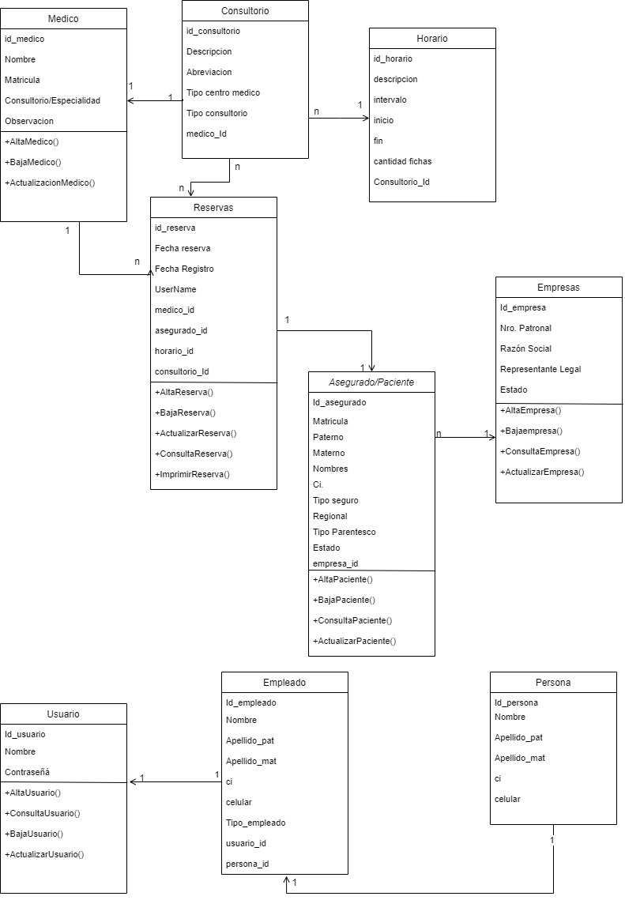

# proyecto reserva de citas medicas
## Introduccion
## Funcionalidades Principales
Descripción
El sistema pretende realizar la atención médica por teleconsulta o presencial en base al diagnóstico inicial, por lo cual el sistema permitirá que la población asegurada a la CNS, desde la comodidad de su casa pueda tener un diagnóstico médico sea este por sospecha Covid-19 u otro tipo de patologías. El ascenso de casos en Bolivia ha generado un desbordamiento de los servicios de salud en todos los consultorios de primer nivel tanto para atención de consulta externa de pacientes sospechosos o con diagnostico Covid-19 o con diferentes patologías.  Con el fin de mejorar procedimientos y agilizar los mismos se propone el desarrollo e implementación del sistema (Teleconsulta), el cual tiene como objetivo dar solución a lo planteado.
Cabe señalar que en la actualidad la caja nacional de salud no tiene implementado un sistema correspondiente a la teleconsulta 

Funcionalidades
•	Administración de Consultorios
•	Creación de consultorios y horarios
•	Reserva de citas médicas app y ventanilla
•	Atención de pacientes por teleconsulta o físico 
•	Diagnóstico de Pacientes

## Casos de Uso

## Maqueta

## diagrama de clases

